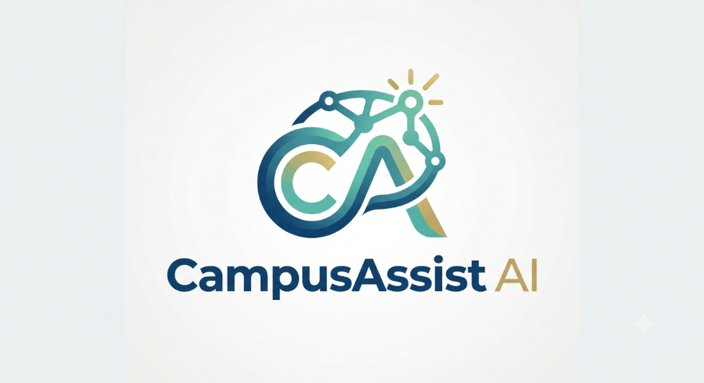

# CampusAssist AI



**CampusAssist AI** is an intelligent, secure, role-based assist portal designed specifically for National Engineering College (NEC). The platform empowers students, faculty, and administrators with intelligent tools, real-time tracking, and AI-driven insights for academic excellence.

## 🌟 Key Features

*   **🔒 Secure Role-Based Access:** Dedicated experiences and dashboards for Students, Faculty, and Administrators.
*   **🤖 Personalized AI Advisor:** An intelligent 24/7 academic support agent right in your pocket.
*   **📊 Smart Application Tracker:** A modern Kanban-style board to track placements, internships, and academic applications.
*   **💡 Opportunities Feed:** Stay updated with the latest workshops, internships, and placement pipelines.
*   **🔔 Real-Time Notifications:** Stay informed with instant alerts on urgency reminders and application updates.
*   **✨ Premium UI/UX:** A stunning, fully responsive design featuring glassmorphism, micro-animations, and dynamic themes.

## 🚀 Getting Started

### Prerequisites
Make sure you have [Node.js](https://nodejs.org/) installed on your machine.

### Installation

1.  Clone the repository:
    ```bash
    git clone https://github.com/Immanuelj15/Campus_Assist-AI.git
    cd Campus_Assist-AI
    ```

2.  Install dependencies:
    ```bash
    npm install
    ```

3.  Start the development server:
    ```bash
    npm run dev
    ```

4.  Open your browser and navigate to `http://localhost:3000`

### 🔑 Demo Credentials

To test the application locally, use the following demo credentials:

*   **Student:** `arun` / `studentpassword`
*   **Faculty:** `srinivasan` / `facultypassword`
*   **Admin:** `admin` / `adminpassword` (Admin Key: `nec_admin_secret_2026`)

## 🛠️ Technology Stack

*   **Frontend:** React (Vite)
*   **Styling:** Tailwind CSS
*   **Icons:** Lucide React
*   **Animations:** Framer Motion (motion/react)
*   **Database/State:** Local `db.json` with an Express Backend server (`server.js`)

## 🤝 Contribution

Contributions, issues, and feature requests are welcome!

---
*Built with ❤️ for National Engineering College.*
